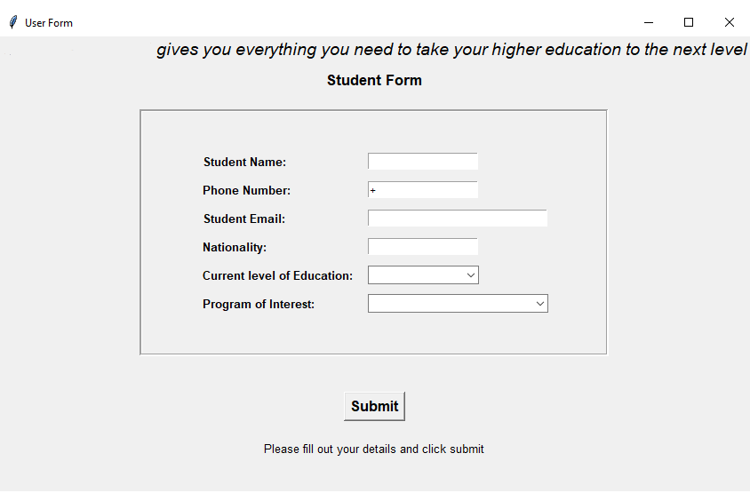

# Lead Collector

This is a Python application built using Tkinter to collect leads offline. It allows users to input lead information, including email, name, phone number, interested program, and current level of education.

## Features

- Collect lead information.
- Save collected leads locally.
- Export leads to a CSV file.

